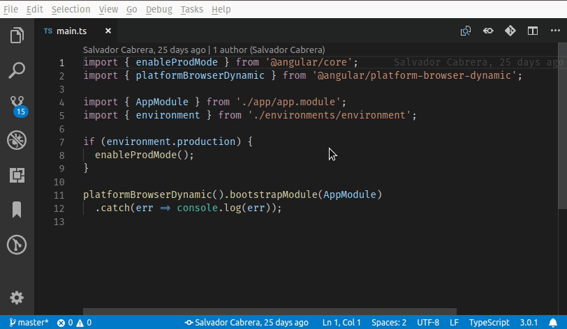

# VS Code Angular CLI Task Provider

## Description
This is used by Angular IDE by [CodeMix](https://www.genuitec.com/products/codemix/) to provide task support for running Angular CLI apps using `ng serve`, `ng build`, etc,.



## Examples

### Running ng serve on port 3000
```
// tasks.json entry
{
    "type": "angularcli",
    "option": "serve",
    "angular": "relative/path/to/angular/workspace", (Directory where the angular.json, angular-cli.json, etc, lives)
    "args": [
        "--port",
        "3000"
    ]
}
```

### Running ng build with production environment
```
// tasks.json entry
{
    "type": "angularcli",
    "option": "build",
    "angular": "relative/path/to/angular/workspace", (Directory where the angular.json, angular-cli.json, etc, lives)
    "args": [
        "--prod"
    ],
    "problemMatchers": [ "$tsc-angular-cli" ]
}
```

### Capturing sass errors with ng serve

```
// tasks.json entry
{
    "type": "angularcli",
    "option": "serve",
    "angular": "relative/path/to/angular/workspace", (Directory where the angular.json, angular-cli.json, etc, lives)
    "problemMatcher": [
        "$tsc-angular-cli-watch",
        {
            "base": "$sass-loader",
            "background": {
                "activeOnStart": true,
                "beginsPattern": "ℹ ｢wdm｣: Compiling...",
                "endsPattern": "ℹ ｢wdm｣: (Failed to compile.|Compiled successfully.)"
            }
        }
    ],
    "isBackground": true
}
```
> You will need the [node-sass problem matcher](https://marketplace.visualstudio.com/items?itemName=Genuitec.sass-loader-problem-matcher) extension to catch sass errors.

## License
MIT